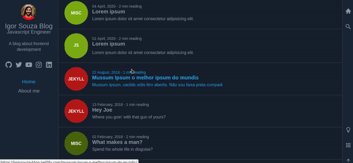

# Gatsby Blog

A simple blog made with Gatsby.js + React.js + Netlify CMS

<div align="center">
  
</div>

## Key features

- Search component powered by [Algolia](https://www.algolia.com/)
- CMS using [Netlify CMS](https://www.netlifycms.org/)
- Transitions between pages using [Gatsby Transition Link](https://www.gatsbyjs.org/packages/gatsby-plugin-transition-link/?=transition)
- Comment section using the [Disqus](https://disqus.com/) lib
- Mobile friendly
- Dark/Light theme
- Grid/List display
- PWA and offline

## Setting up

### Requirements

- [Node.js](https://nodejs.org/en/download/)
- [Npm](https://www.npmjs.com/get-npm)
- [Yarn](https://yarnpkg.com/lang/en/docs/install/#debian-stable) - This is optional but in this readme I'll be using it on some CLI commands, you can use npm if you want.
- [Gatsby CLI](https://www.gatsbyjs.org/docs/quick-start/)

## Installing

All you need to do is run `yarn` at the root of the project in order to install the dependencies.
After installation, copy the `.env.example` and rename it to `.env`. Change the _Algolia_ variables values according to your settings.

## Running the project

Running a developer version:

```
yarn start
or
gatsby develop
```

Building for production:

```
yarn build
or
gatsby build
```

## Searching blog posts

In order for the blog posts searching to work (route /search), you need to setup an Algolia account and create the indexes. To upload the content to Algolia just run `gatsby build`. Don't forget to inform your api keys at the `.env`.

## The CMS

When you are in developing mode, just access the `/admin` route. This will open the UI for the CMS.

## Comments Section

The comment section is powered by [Disqus](https://disqus.com/), you must setup an account at their website and inform the shortname at the `.env` file. Also, after publishing your app, you need to inform the url at the `.env` file.

## License

This is a open-sourced software licensed under the [MIT license](LICENSE.md).
